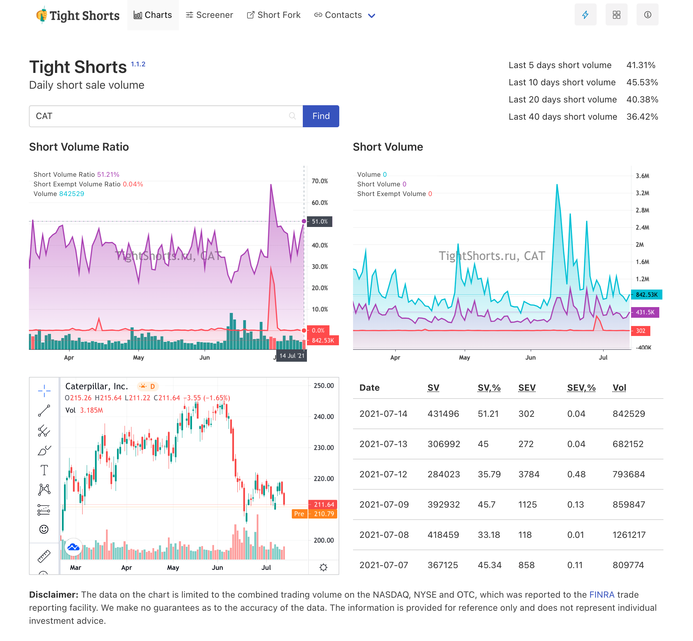
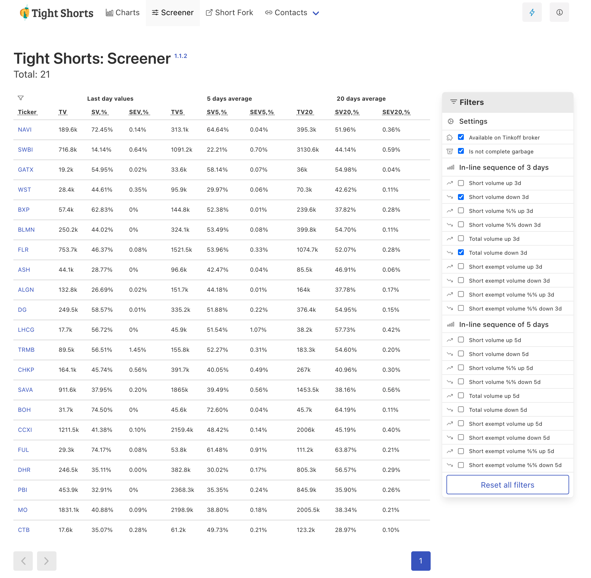

# TightShorts

Tight Shorts - open-source stocks short volume charts. The service presents FINRA reports in a more visual form. You can use it to estimate the total trading volume, short volume, short exempt volume and download the annual report on the short volumes of the selected stock.

**Tight Shorts** can be a great addition to your trading strategy!

Link: **[tightshorts.ru](https://tightshorts.ru/)**

Backend and API code: [finra-short-api](https://github.com/samgozman/finra-short-api)

_The project is under active development. Any fixes and improvements are greatly appreciated!_

## Short volume screener

**Disclaimer:** The data that we use is limited to the combined trading volume on the NASDAQ, NYSE and OTC, which was reported to the [FINRA](http://regsho.finra.org/regsho-Index.html) trade reporting facility. We make no guarantees as to the accuracy of the data. The information is provided for reference only and does not represent individual investment advice.
